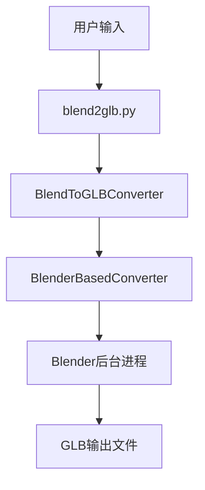

# 项目结构概览

## 📁 目录结构

```
blend_to_glb_converter/
├── 📄 README.md                    # 主要项目文档
├── 📄 QUICKSTART_CN.md             # 快速开始指南
├── 📄 CONTRIBUTING.md              # 贡献指南
├── 📄 CHANGELOG.md                 # 更新日志
├── 📄 setup.py                     # 项目安装配置
├── 📄 requirements.txt             # Python依赖
├── 📄 blend2glb.py                 # 主入口文件
│
├── 📁 core/                        # 核心模块
│   ├── 📄 __init__.py
│   ├── 📄 converter_v2.py          # 新版转换器（主要）
│   ├── 📄 blender_backend.py       # Blender后端引擎
│   ├── 📄 blend_reader.py          # Blend文件读取器
│   ├── 📄 converter.py             # 旧版转换器（已弃用）
│   └── 📄 glb_converter.py         # GLB转换器（已弃用）
│
├── 📁 cli/                         # 命令行界面
│   ├── 📄 __init__.py
│   └── 📄 main.py                  # CLI主程序
│
├── 📁 tests/                       # 测试文件
│   ├── 📄 __init__.py
│   └── 📄 test_converter.py        # 转换器测试
│
├── 📁 examples/                    # 使用示例
│   └── 📄 basic_usage.py           # 基本使用示例
│
├── 📁 test_data/                   # 测试数据
│   └── 📄 sample.blend             # 示例Blend文件
│
└── 📁 docs/                        # 详细文档
    └── 📄 API.md                   # API文档
```

## 🔧 核心组件

### 主要模块

| 模块 | 功能 | 状态 |
|------|------|------|
| `converter_v2.py` | 新版转换器，使用Blender后端 | ✅ 活跃 |
| `blender_backend.py` | Blender引擎集成 | ✅ 活跃 |
| `blend_reader.py` | Blend文件信息读取 | ✅ 活跃 |
| `converter.py` | 旧版转换器 | ❌ 已弃用 |
| `glb_converter.py` | 旧版GLB转换 | ❌ 已弃用 |

### 入口点

| 文件 | 用途 | 推荐使用 |
|------|------|----------|
| `blend2glb.py` | 主命令行工具 | ✅ 推荐 |
| `cli/main.py` | 备用CLI工具 | ⚠️ 可选 |

## 🚀 使用流程



## 📋 开发指南

### 添加新功能
1. 在 `core/converter_v2.py` 中扩展 `BlendToGLBConverter` 类
2. 在 `core/blender_backend.py` 中添加Blender脚本支持
3. 在 `tests/test_converter.py` 中添加测试用例

### 修改CLI
1. 编辑 `blend2glb.py` 的参数解析
2. 更新 `cli/main.py` 保持一致性
3. 更新文档中的使用示例

### 测试
```bash
# 运行所有测试
python -m pytest tests/ -v

# 测试特定功能
python -m pytest tests/test_converter.py::TestBlendToGLBConverter -v
```

## 🔄 版本历史

- **V2.0**: 使用Blender后端，100%准确转换
- **V1.0**: 纯Python实现（已弃用）

## 📝 注意事项

1. **主要使用 V2.0**: 新版转换器提供更好的准确性
2. **Blender依赖**: 确保系统已安装Blender
3. **向后兼容**: API保持兼容，但内部实现完全重写
4. **测试覆盖**: 所有核心功能都有对应测试用例

---

**维护者**: 请在修改项目结构时同步更新此文档。